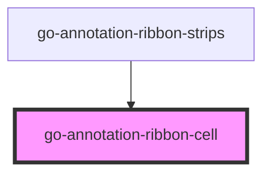

# go-annotation-ribbon-cell

<!-- Auto Generated Below -->

## Properties

| Property           | Attribute           | Description                                                                                                                                     | Type             | Default                    |
| ------------------ | ------------------- | ----------------------------------------------------------------------------------------------------------------------------------------------- | ---------------- | -------------------------- |
| `annotationLabels` | `annotation-labels` |                                                                                                                                                 | `string`         | `"annotation,annotations"` |
| `available`        | `available`         | If set to true, won't show any color and can not be hovered or selected This is used for group that can not have annotation for a given subject | `boolean`        | `true`                     |
| `binaryColor`      | `binary-color`      |                                                                                                                                                 | `boolean`        | `false`                    |
| `classLabels`      | `class-labels`      |                                                                                                                                                 | `string`         | `"term,terms"`             |
| `colorBy`          | `color-by`          |                                                                                                                                                 | `number`         | `COLOR_BY.CLASS_COUNT`     |
| `group`            | --                  |                                                                                                                                                 | `IRibbonGroup`   | `undefined`                |
| `hovered`          | `hovered`           |                                                                                                                                                 | `boolean`        | `false`                    |
| `maxColor`         | `max-color`         |                                                                                                                                                 | `string`         | `"24,73,180"`              |
| `maxHeatLevel`     | `max-heat-level`    |                                                                                                                                                 | `number`         | `48`                       |
| `minColor`         | `min-color`         |                                                                                                                                                 | `string`         | `"255,255,255"`            |
| `selected`         | `selected`          |                                                                                                                                                 | `boolean`        | `false`                    |
| `subject`          | --                  |                                                                                                                                                 | `IRibbonSubject` | `undefined`                |

## Dependencies

### Used by

 - [go-annotation-ribbon-strips](../annotation-ribbon-strips)

### Graph

----------------------------------------------

*Built with [StencilJS](https://stenciljs.com/)*
