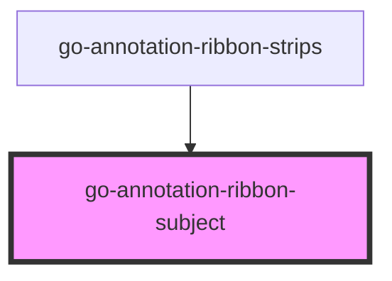

# go-annotation-ribbon-subject

<!-- Auto Generated Below -->

## Properties

| Property         | Attribute            | Description | Type             | Default     |
| ---------------- | -------------------- | ----------- | ---------------- | ----------- |
| `newTab`         | `new-tab`            |             | `boolean`        | `undefined` |
| `subject`        | --                   |             | `IRibbonSubject` | `undefined` |
| `subjectBaseURL` | `subject-base-u-r-l` |             | `string`         | `undefined` |

## Events

| Event          | Description                                                                                                                                           | Type               |
| -------------- | ----------------------------------------------------------------------------------------------------------------------------------------------------- | ------------------ |
| `subjectClick` | This event is triggered whenever a subject label is clicked Can call preventDefault() to avoid the default behavior (opening the linked subject page) | `CustomEvent<any>` |

## Dependencies

### Used by

 - [go-annotation-ribbon-strips](../annotation-ribbon-strips)

### Graph

----------------------------------------------

*Built with [StencilJS](https://stenciljs.com/)*
