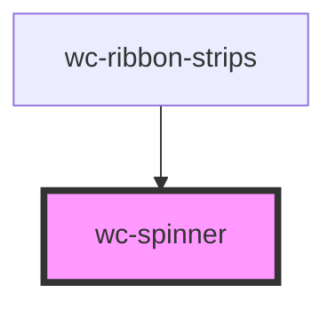

# my-component

<!-- Auto Generated Below -->

## Properties

| Property       | Attribute       | Description                                                                                                                                             | Type     | Default     |
| -------------- | --------------- | ------------------------------------------------------------------------------------------------------------------------------------------------------- | -------- | ----------- |
| `spinnerColor` | `spinner-color` | Define the color of the spinner. This parameter is optional and will override any declared CSS variable                                                 | `string` | `undefined` |
| `spinnerSize`  | `spinner-size`  | Define the size of the spinner (TO DO).                                                                                                                 | `number` | `undefined` |
| `spinnerStyle` | `spinner-style` | Define the style of the spinner. Accepted values: default, spinner, circle, ring, dual-ring, roller, ellipsis, grid, hourglass, ripple, facebook, heart | `string` | `undefined` |

## Dependencies

### Used by

- [wc-ribbon-strips](../go-ribbon-strips)

### Graph

---

_Built with [StencilJS](https://stenciljs.com/)_
