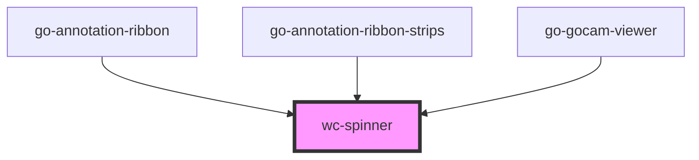

# my-component

<!-- Auto Generated Below -->

## Properties

| Property  | Attribute | Description | Type     | Default     |
| --------- | --------- | ----------- | -------- | ----------- |
| `message` | `message` |             | `string` | `undefined` |

## CSS Custom Properties

| Name      | Description          |
| --------- | -------------------- |
| `--color` | Color of the spinner |
| `--size`  | Size of the spinner  |

## Dependencies

### Used by

 - [go-annotation-ribbon](../annotation-ribbon)
 - [go-annotation-ribbon-strips](../annotation-ribbon-strips)
 - [go-gocam-viewer](../gocam-viewer)

### Graph

----------------------------------------------

*Built with [StencilJS](https://stenciljs.com/)*
